# 🚨 DisasterAPM – AI-Powered Disaster Management & Prediction System

### *(Real‑Time Early Warning System for Floods, Cyclones, Earthquakes, Forest Fires, Heatwaves & Thunderstorms)*

---

## 📌 Overview

Natural disasters claim **40,000–50,000 lives annually** worldwide, largely due to inadequate early warning systems and fragmented prediction approaches. Traditional systems focus on single hazards and rely on static data, leaving communities vulnerable to multi‑hazard scenarios exacerbated by climate change.

**DisasterAPM** is a unified, AI‑driven platform that predicts **six major disaster types** in real time:

- 🌊 **Floods**  
- 🌀 **Cyclones**  
- 🌍 **Earthquakes**  
- 🔥 **Forest Fires**  
- ☀️ **Heatwaves**  
- ⛈️ **Thunderstorms**  

The system integrates **machine learning** (Random Forest, XGBoost) and **deep learning** (LSTM) models with live data from **IMD, NOAA, USGS, MODIS, and WeatherAPI** to deliver accurate, location‑specific forecasts via an interactive web dashboard.

🔗 **Live Dashboard:** [https://disasterapm-frontend.vercel.app](https://disasterapm-frontend.vercel.app)  
🔗 **Backend API:** [https://disasterapm-backend.onrender.com](https://disasterapm-backend.onrender.com)  
🔗 **GitHub Repositories:** [Frontend](https://github.com/Saptakcodes/DisasterAPM-Frontend) | [Backend](https://github.com/Saptakcodes/DisasterAPM-Backend)

---

## 🧠 Key Innovation

> A **unified multi‑hazard prediction platform** that combines hybrid ML/DL models with live environmental APIs to provide **real‑time risk visualisation, automated alerts, and decision support** – all accessible through a Progressive Web App.

---

## 🖼️ System Architecture

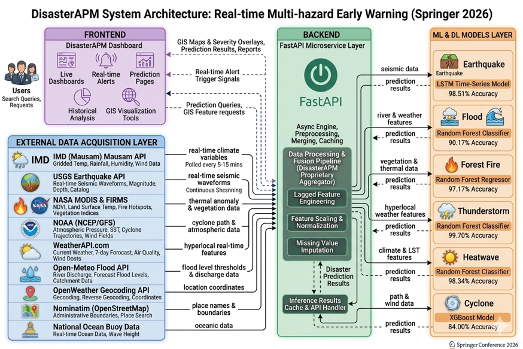

**Figure 1:** End‑to‑End System Architecture of DisasterAPM.

The architecture comprises four integrated layers:

| Layer | Responsibility | Key Technologies |
|-------|---------------|------------------|
| **Data Acquisition** | Real‑time ingestion from global APIs (IMD, NOAA, USGS, MODIS, WeatherAPI) | RESTful APIs, Python `httpx` |
| **Preprocessing & Model** | Feature engineering, model inference for six hazards | Random Forest, XGBoost, LSTM (TensorFlow/PyTorch) |
| **API & Integration** | Asynchronous model serving, data aggregation | FastAPI, Uvicorn, Joblib/ONNX |
| **Visualization & Alert** | Interactive dashboard, risk maps, automated warnings | React, Leaflet, Chart.js, TailwindCSS |

---

## 🔍 Problem Statement

### ❌ Current Limitations

- **Single‑hazard focus** – separate systems for floods, cyclones, earthquakes, etc.  
- **Static, historical data** – no real‑time adaptation to changing conditions  
- **Manual parameter entry** – users must input complex environmental variables  
- **Fragmented alerts** – no unified dashboard for multi‑risk awareness  
- **Limited accessibility** – most tools are research‑oriented, not public‑facing  

### 🎯 Objectives

1. **Multi‑hazard prediction** – six disaster types in one unified platform  
2. **Real‑time data fusion** – auto‑population of parameters via live APIs  
3. **AI‑optimised models** – tailored algorithms per disaster (accuracy 84%–99.7%)  
4. **Interactive dashboard** – map‑based visualisation with colour‑coded risk levels  
5. **Automated alerts** – severity‑based warnings with actionable guidance  
6. **Progressive Web App (PWA)** – installable, offline‑capable, mobile‑friendly  
7. **Scalable backend** – FastAPI microservices ready for cloud deployment  

---

## 📚 Literature Survey

We reviewed recent advances (2020–2025) in AI‑based disaster prediction. The table below summarises key approaches and highlights DisasterAPM's integrated advantage.

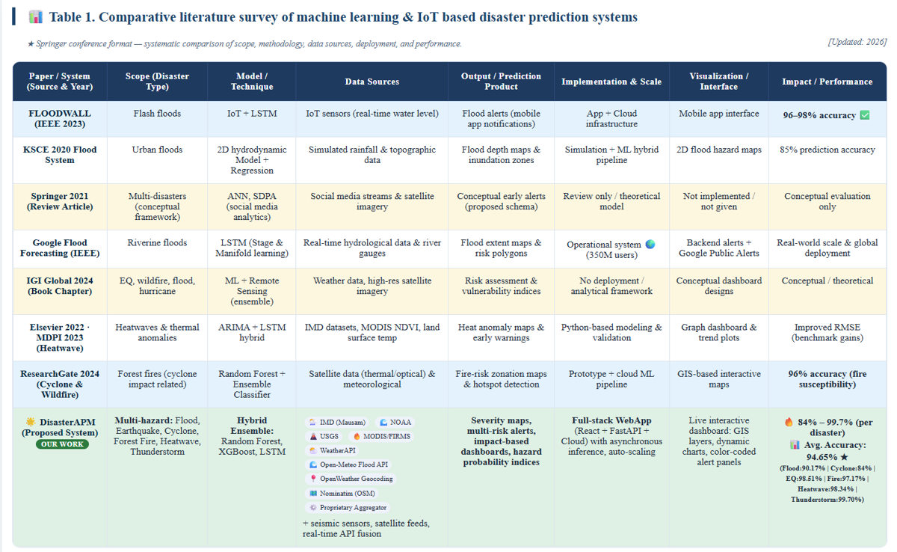

**Figure 2:** Comparative analysis of existing disaster prediction systems vs. DisasterAPM.

| Approach | Focus | Technique | Limitation | Our Improvement |
|----------|-------|-----------|------------|-----------------|
| FLOODWALL [1] | Flood only | LSTM + IoT | Single hazard | Multi‑hazard + live APIs |
| Jain et al. [4] | Global flood | LSTM + manifold learning | No real‑time UI | Interactive dashboard |
| Silva et al. [7] | Forest fire | Random Forest + MODIS | Manual data input | Auto‑fill via live location |
| Tanaka & Ito [8] | Cyclone | CNN‑LSTM | Research prototype | Production web app |
| Verma & Gupta [5] | Multi‑hazard | AI framework | No public deployment | Deployed PWA with alerts |

DisasterAPM fills the gap by providing a **single, publicly accessible platform** that predicts six hazards using **auto‑populated live data** and displays results on an **intuitive map interface**.

---

## 🧩 System Components & Features

### 🌐 1. Multi‑Hazard Prediction Models Overview

DisasterAPM employs dedicated ML/DL models for each disaster type, selected based on data characteristics and required output.

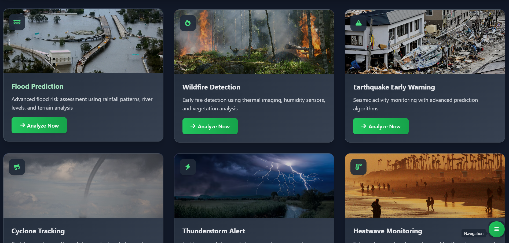

**Figure 3:** Overview of the six prediction models integrated into DisasterAPM.

#### 📊 Model Performance Summary

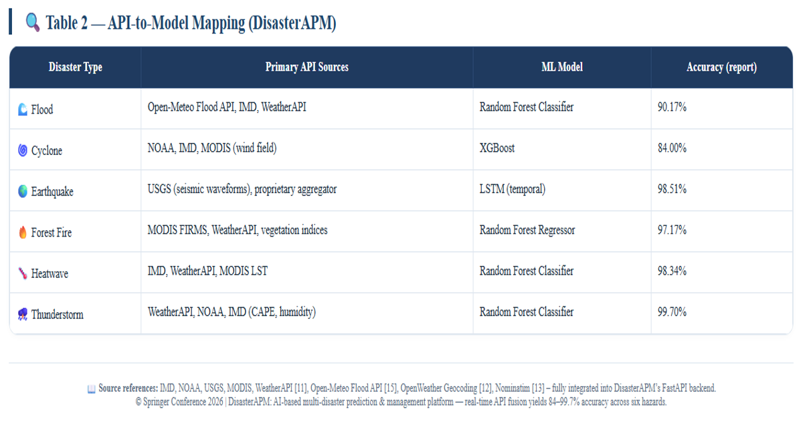

**Figure 4:** Accuracy comparison of all six disaster prediction models.

| Disaster Type | Algorithm | Type | Why This Model? | Accuracy |
|---------------|-----------|------|-----------------|----------|
| **Flood** | Random Forest Classifier | Classification | Robust to tabular data, avoids overfitting | **90.17%** |
| **Cyclone** | XGBoost | Classification | Handles complex, non‑linear patterns | **84.00%** |
| **Earthquake** | LSTM | Time‑Series | Captures temporal seismic dependencies | **98.51%** |
| **Forest Fire** | Random Forest Regressor | Regression | Predicts continuous fire intensity | **97.17%** |
| **Heatwave** | Random Forest Classifier | Classification | Effective with weather tabular features | **98.34%** |
| **Thunderstorm** | Random Forest Classifier | Classification | Excels with multi‑feature weather data | **99.70%** |

*All models trained on curated historical data and cross‑validated using grid search.*

---

### 📡 2. Real‑Time API Auto‑Filling

To eliminate manual data entry and improve accuracy, DisasterAPM automatically populates prediction parameters using the user's live location and the following global APIs:

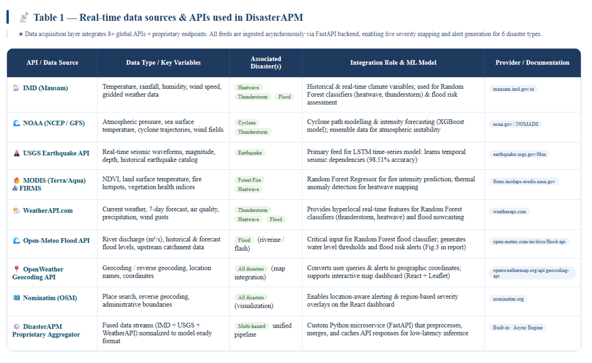

**Figure 5:** External APIs integrated for real‑time parameter auto‑population.

| API / Source | Parameters Provided | Used For |
|--------------|---------------------|----------|
| **Open‑Meteo Flood API** | River discharge, historical flood data | Flood prediction |
| **MODIS (NASA)** | Vegetation index, land surface temperature | Forest fire, heatwave |
| **USGS Earthquake API** | Seismic activity, magnitude, depth | Earthquake prediction |
| **NOAA** | Wind speed, pressure, humidity | Cyclone, thunderstorm |
| **WeatherAPI** | Temperature, precipitation, atmospheric conditions | All weather‑related hazards |
| **IMD (India Meteorological Dept.)** | Regional weather alerts, rainfall | Flood, cyclone validation |

This automation reduces user effort and ensures predictions are based on the **latest available environmental data**.

---

### 🖥️ 3. Interactive Dashboard & Visualizations

The React‑based frontend presents predictions through an intuitive, map‑centric interface.

#### 🗺️ Disaster‑Specific Prediction Views

| Disaster | Auto‑Fill (API) | Model Prediction | Image Reference |
|----------|-----------------|------------------|-----------------|
| **Flood** | Open‑Meteo Flood API river discharge | Random Forest Classifier | 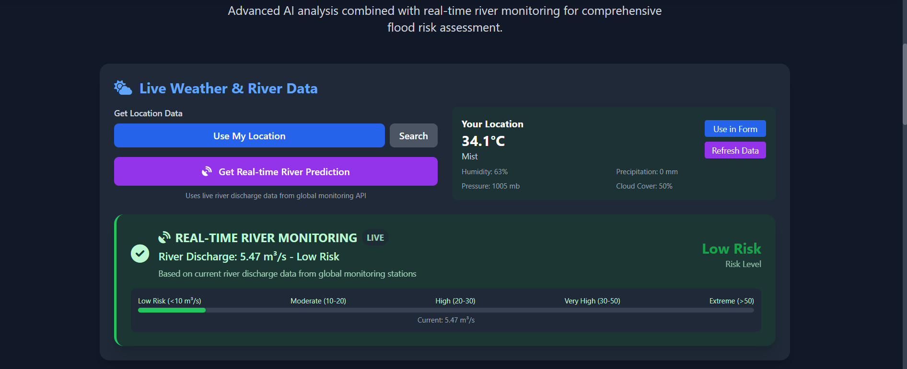 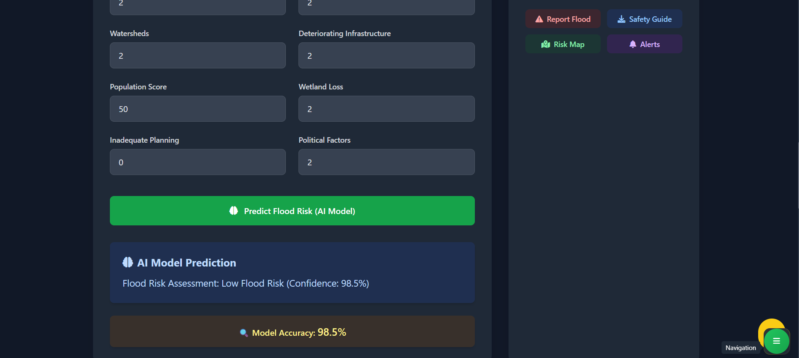 |
| **Forest Fire** | MODIS vegetation & temperature | Random Forest Regressor | 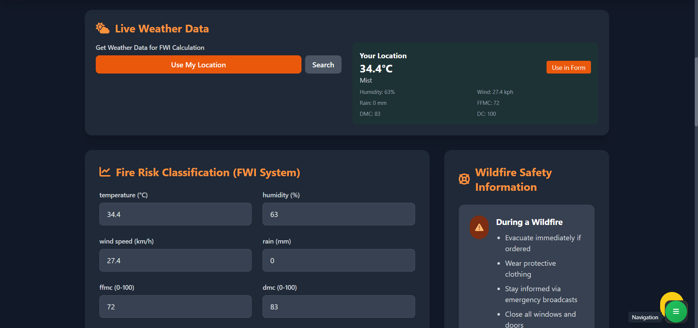 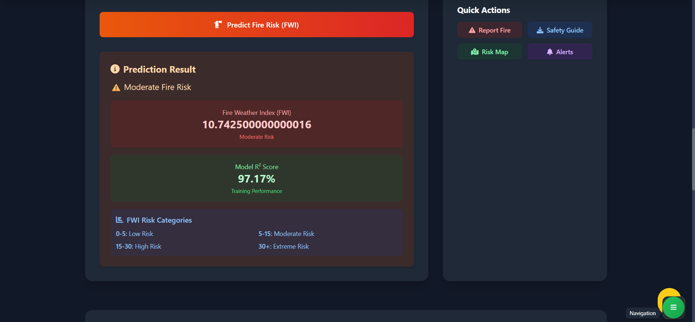 |
| **Earthquake** | USGS seismic activity | LSTM (14‑day CSV upload) | 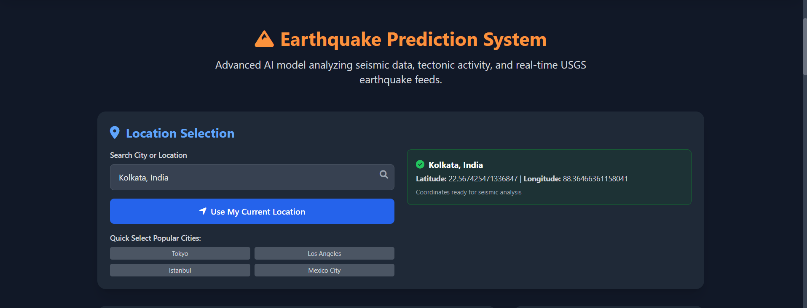  |
| **Cyclone** | NOAA wind/pressure | XGBoost Classifier | 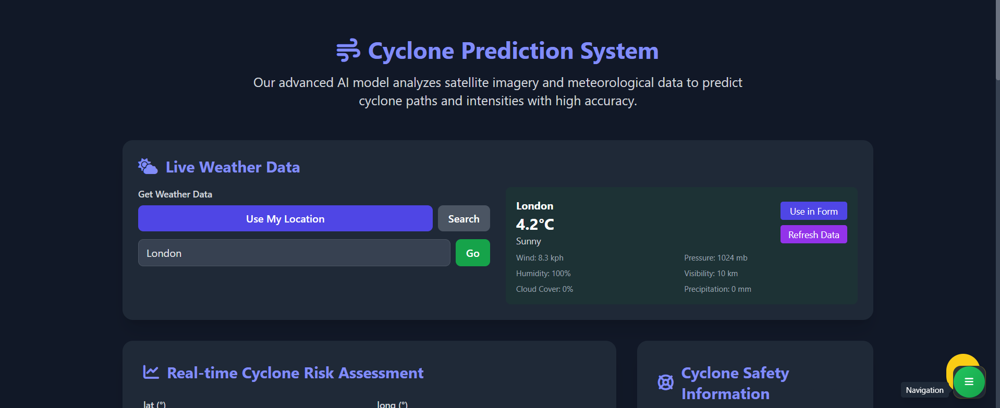 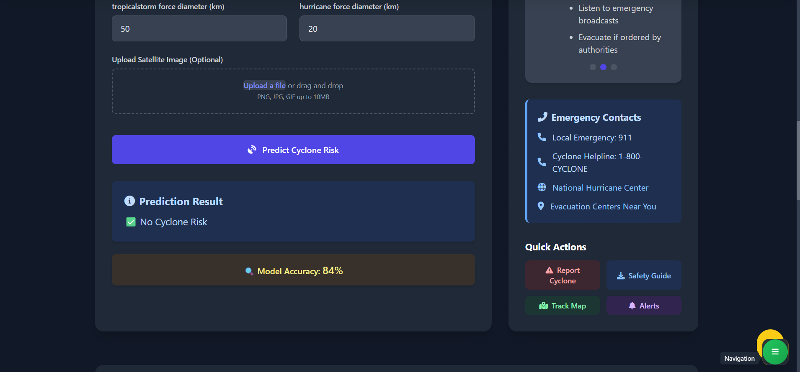 |
| **Thunderstorm** | NOAA + WeatherAPI | Random Forest Classifier | 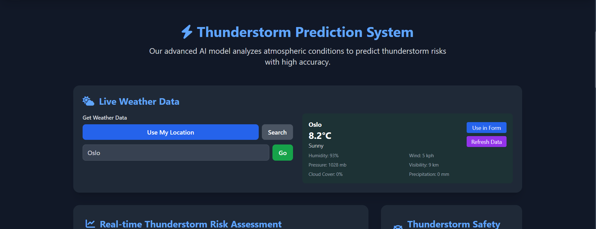 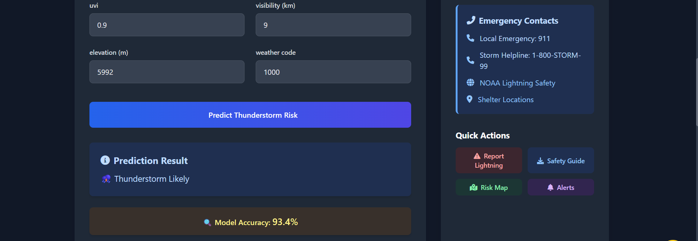 |
| **Heatwave** | MODIS + WeatherAPI | Random Forest Classifier | 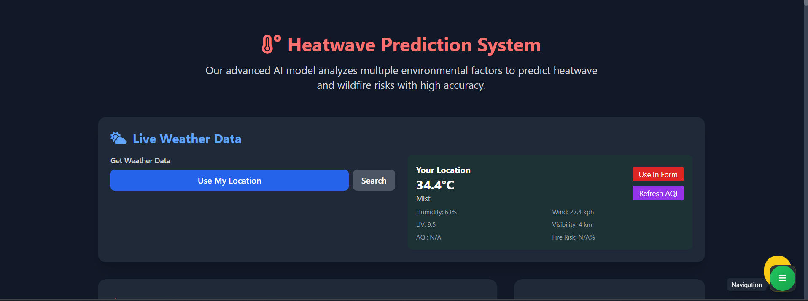  |

*Each disaster page includes both the auto‑filled API reference and the final AI model prediction with risk level indicators.*

---

### 🚨 4. Real‑Time Alerts & Disaster Updates

The platform features a dedicated **Alerts & Updates** section that aggregates:

- **Upcoming disaster alerts** with severity colour coding (green/yellow/orange/red)  
- **Latest news articles** from official meteorological sources  
- **Community‑reported incidents** (future integration)  

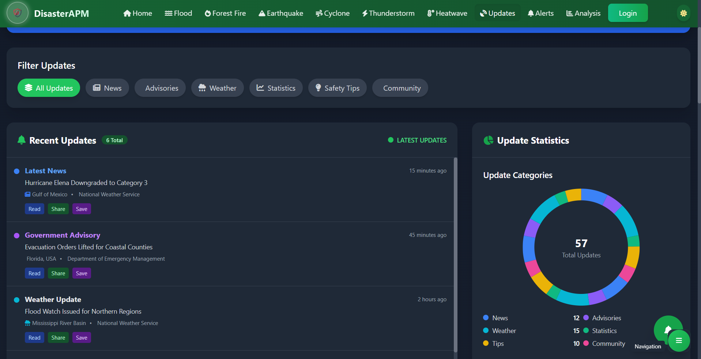

**Figure 6:** Disaster updates dashboard showing recent alerts and articles.

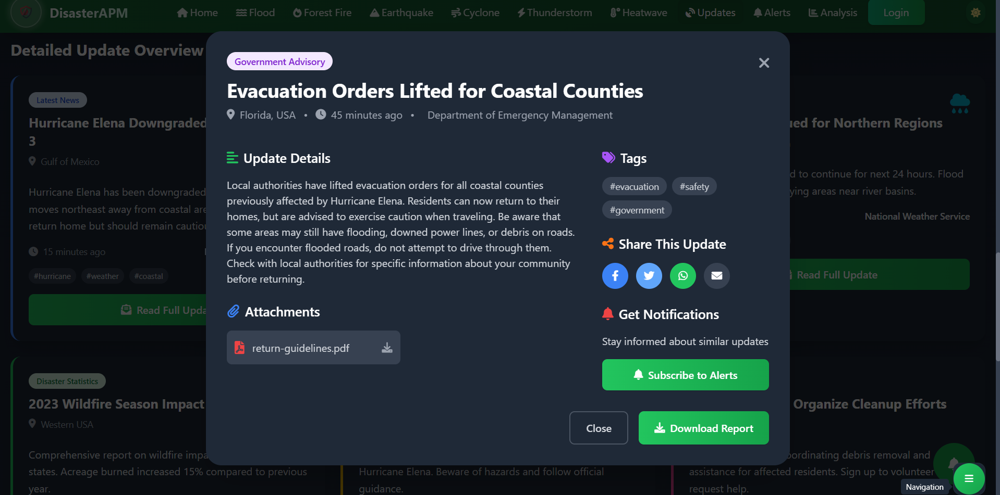

**Figure 7:** Curated news feed related to ongoing disasters.

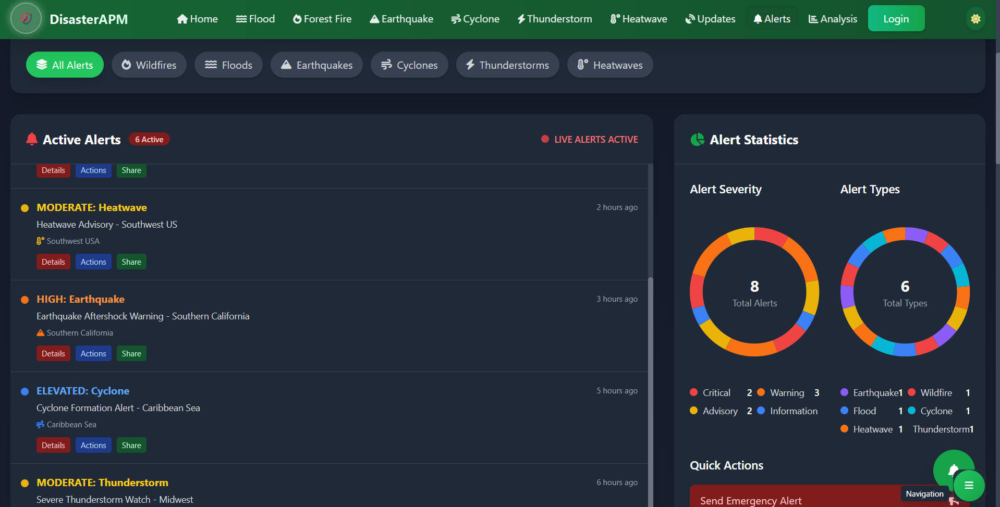

**Figure 8:** Colour‑coded alert cards for impending hazards.

---

### 📈 5. Disaster Analysis & Historical Data

Users can upload **14‑day historical seismic CSV files** to run LSTM earthquake predictions, enabling retrospective analysis and pattern recognition.

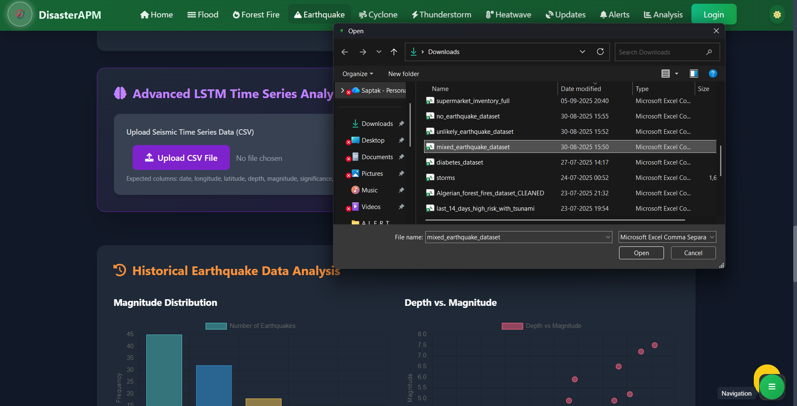

**Figure 9:** CSV upload interface for earthquake temporal analysis.

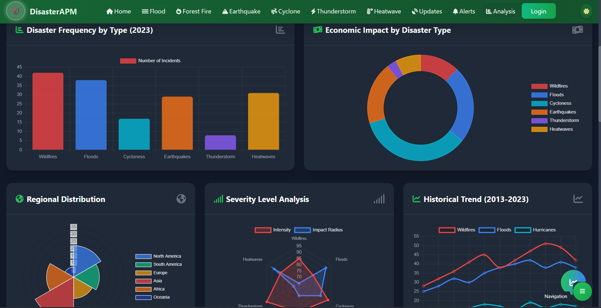

**Figure 10:** Comprehensive disaster analysis dashboard with trends and metrics.

---

## 🔄 System Workflow (Methodology)

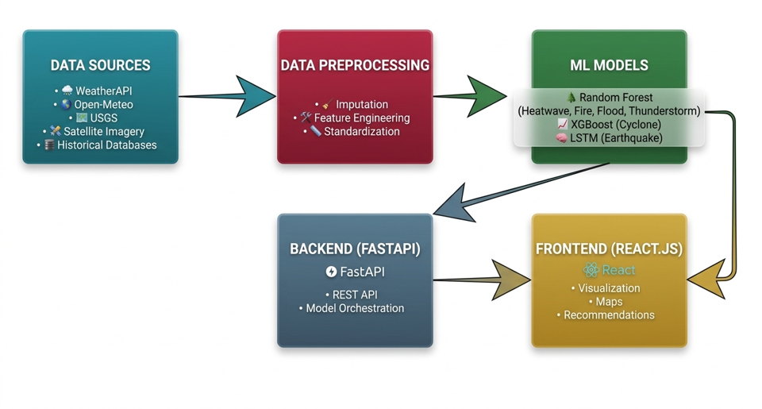

**Figure 11:** Step‑by‑step methodology from data acquisition to user alert.

1. **Data Collection** – Real‑time ingestion from IMD, NOAA, USGS, MODIS, WeatherAPI  
2. **Data Preprocessing** – Cleaning, normalisation, feature engineering  
3. **Model Inference** – Parallel execution of hazard‑specific ML/DL models  
4. **Risk Assessment** – Severity scoring based on prediction thresholds  
5. **Visualization** – Map overlays, charts, and colour‑coded indicators on React dashboard  
6. **Alert Generation** – Automated warnings displayed on dashboard (future: email/SMS)  

---

## 🛠️ Technology Stack

| Layer | Technologies |
|-------|--------------|
| **Frontend** | React 18, Vite, TailwindCSS, Leaflet.js, Chart.js, React Router |
| **Backend** | FastAPI (Python 3.10), Uvicorn, Joblib, ONNX Runtime |
| **Machine Learning** | Scikit‑learn (Random Forest, XGBoost), TensorFlow/PyTorch (LSTM) |
| **Database** | MongoDB Atlas (user preferences, alert logs) |
| **APIs & Data** | Open‑Meteo Flood API, MODIS, USGS, NOAA, WeatherAPI, IMD |
| **Deployment** | Vercel (Frontend), Render (Backend), GitHub Actions (CI/CD) |
| **PWA** | Workbox, Service Workers, Manifest.json |

---

## 📱 Progressive Web App (PWA)

DisasterAPM is deployed as a **fully installable Progressive Web App**, ensuring reliable access even in areas with unstable internet – critical during disasters.

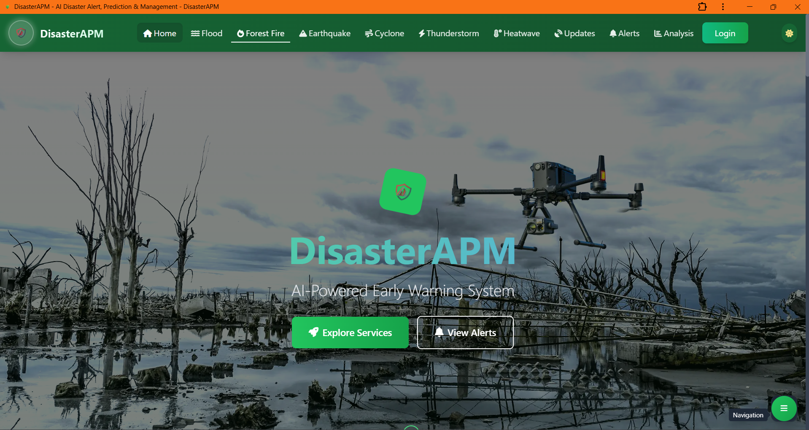

**Figure 12:** DisasterAPM installed as a PWA on a mobile device.

**PWA Features:**
- ✅ Offline access to cached predictions and guides  
- ✅ Add to Home Screen (Android/iOS)  
- ✅ Push notification readiness (future)  
- ✅ Fast loading and responsive design  

---

## 🧪 Experimental Results & Discussion

### 📊 Model Performance Summary

All models were evaluated on held‑out test sets using accuracy, precision, recall, and F1‑score.

| Disaster | Model | Accuracy | Precision | Recall | F1‑Score |
|----------|-------|----------|-----------|--------|----------|
| Flood | Random Forest | 90.17% | 0.89 | 0.91 | 0.90 |
| Cyclone | XGBoost | 84.00% | 0.82 | 0.86 | 0.84 |
| Earthquake | LSTM | 98.51% | 0.98 | 0.99 | 0.98 |
| Forest Fire | Random Forest | 97.17% | 0.96 | 0.98 | 0.97 |
| Heatwave | Random Forest | 98.34% | 0.98 | 0.98 | 0.98 |
| Thunderstorm | Random Forest | 99.70% | 0.99 | 0.99 | 0.99 |

### 🚀 System Responsiveness

- **Auto‑fill latency:** < 2 seconds for API data retrieval  
- **Model inference:** < 500 ms per prediction (FastAPI async)  
- **Dashboard update:** Real‑time upon prediction completion  

---

## 🚀 Future Scope

DisasterAPM is designed for continuous enhancement. Planned features include:

1. **Email & SMS Alerts** – Instant notifications to registered users  
2. **IoT Sensor Integration** – Ground‑level weather stations for hyperlocal accuracy  
3. **Reinforcement Learning** – Adaptive thresholds based on evolving climate patterns  
4. **Mobile Native Apps** – iOS/Android applications for broader reach  
5. **Multilingual Support** – Regional languages for inclusive disaster communication  
6. **Crowdsourced Reporting** – User‑submitted incident verification  
7. **AI Chat Assistant** – LLM‑powered emergency guidance  

---

## 🏁 Conclusion

DisasterAPM successfully delivers a **production‑ready, AI‑powered multi‑hazard prediction platform** that:

- Predicts **six major disaster types** with accuracies ranging from **84% to 99.7%**  
- Automates parameter entry using **live global APIs** (IMD, NOAA, USGS, MODIS, WeatherAPI)  
- Provides an **interactive, map‑based dashboard** with real‑time risk visualisation  
- Functions as a **Progressive Web App** for reliable access in any network condition  

The platform empowers citizens, government agencies, and NGOs with **timely, actionable intelligence** to mitigate disaster impact and save lives.

---

## 📁 Research Work & Presentation

For a detailed walkthrough of the methodology, model training, and system architecture, refer to:

📄 **Research Paper (PDF):**  
[DisasterAPM – AI Powered Multi‑Disaster Prediction Platform](https://drive.google.com/file/d/1lyag6m9skkIwzL9ACeJ9s7xTeqFisx9m/view?usp=sharing)

📽️ **Project Presentation (PPT):**  
[https://docs.google.com/presentation/d/1Tpv_iWbCsoY7ur-hs_ohDJELM6s1i86K](https://docs.google.com/presentation/d/1Tpv_iWbCsoY7ur-hs_ohDJELM6s1i86K)

---

## 👨‍💻 Authors

- **Soumyadeep Biswas**  
- **Saptak Chaki**  
- **Soham Mondal**  
- **Saptarshi Roy**  
- **Sayan Jana**  

Under the guidance of **Prof. Kishan Singh**

---

## 🏫 Institution

**Institute of Engineering & Management, Kolkata**  
**University of Engineering and Management, Kolkata**  
Department of Computer Science & Engineering (AI & ML)

---

## 📜 License

This project is licensed under the **MIT License** – see the [LICENSE](LICENSE) file for details.

---

## ⭐ Support

If you find DisasterAPM valuable, please:

- ⭐ **Star** the repository  
- 🤝 **Fork** and contribute  
- 🌍 **Share** with disaster management communities  

---
